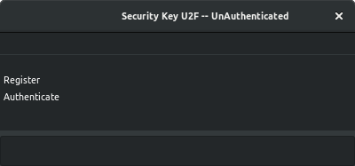

U2F Test examples for local security key use
---

Currently storing registrations in a json formatted flat file

```
go get github.com/davidwalter0/go-u2f
pushd ${GOPATH}/github.com/davidwalter0/go-u2f/cmd/u2f-ui
go build -ldflags '-w -s'
export FILENAME=registrations.json
./u2f-ui
```


```
go get github.com/davidwalter0/go-u2f
pushd ${GOPATH}/github.com/davidwalter0/go-u2f/cmd/cli
go build -ldflags '-w -s'
export FILENAME=registrations.json
./cli
2018/11/19 23:35:17 Insert Security Key
2018/11/19 23:35:17 Press key to authenticate
2018/11/19 23:35:17 Action Register
2018/11/19 23:35:17 Saw Message Register
2018/11/19 23:35:17 Saw Message Register: Press key to authenticate
2018/11/19 23:35:20 Action Authenticate
2018/11/19 23:35:20 Saw Message Registered
2018/11/19 23:35:20 Saw Message Authenticate
2018/11/19 23:35:20 Saw Message Authenticate: Press key to authenticate
2018/11/19 23:35:23 Exiting in 3 
2018/11/19 23:35:23 Saw Message Authenticated
...
```
